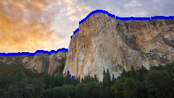
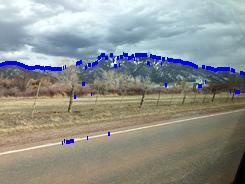
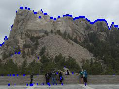
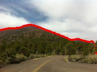
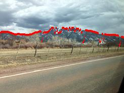
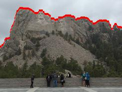

# a2-2

## Part 2: Finding horizons

Here, we tackle one of the most classic problems in computer vision in which we need to identify where exactly a picture was taken on our planet. We focus on rather a subset of this problem here, with the assumption that if we're able to identify the horizon decently enough, we could use this as a fingerprint and match it with a digital elevation map to classify where a particular image was taken.

We're assuming here that the images we work/test on will have clear looking mountain ridges, with nothing blocking them, and that the sky is relatively clear. We need to "estimate" the row of the image corresponding to the ridge boundary and plot the estimated row to get our superimposed image.

### Bayes Net
We've already been give the code to calculate the edge strength map of a given image that simply measures the local gradient strength at each point. Using the naive bayes net algorithm is real simple: we just take the max of each column of each row at a particular instance using the argmax function provided by numpy. Some of the results are as follows:

Not bad, but... bad. What can we do here?

### Viterbi
We could try to find all the different scenarios of hidden states for the given sequence of pixels and then identify the most probable one. However, it will be an exponentially complex problem to solve. To get better results, we implement the Viterbi algorithm, that is a dynamic programming approach to solve the problem. We basically expand on the idea that at each time step we calculate, we only need to store the sequence path to the pixel that has the best probability going into each state. If our HMM has only 2 states for instance, we only need to store at most 2 paths, updated at every time step, because all that matters for the next time step is where we were at in the previous time step. That's basically it.
To implement that in code, it sure was tricky! We've implemented the viterbi algorithm in two rather similar ways, one that involves backtracking overtly, the other one not needing one due to memoization. One using log of the probabilities, while the other one uses the probabilities, like straight up. We kept both in the code and used one for the regular viterbi part and the other for the human feedback part that we'll come across in a second.

In the viterbi function that doesn't involve logs, we started out with normally distributed initial probabilities, followed by the emission probabilities that were the result of each pixel's value divided by the max of it's row. The transitional probabilities were the absolute value of each row normalized using it's respective max column values. The two numpy arrays first_product and second_product keep track of each 2 states along the way, after updating with the max of the previous column and the current column's transitional and emission probability. Then, we just backtrack using the two numpy arrays first_product and second_product to get out resultant_matrix, i.e. the y-coordinates to superimpose on top of the original image. Some sample outputs:

Better. But can it be improved even further?

### Viterbi with human feedback

Now, in this case, everything else is same, except we're given a set of pixel coordinates that we can assume lie on the ridge of the mountain of a given picture.